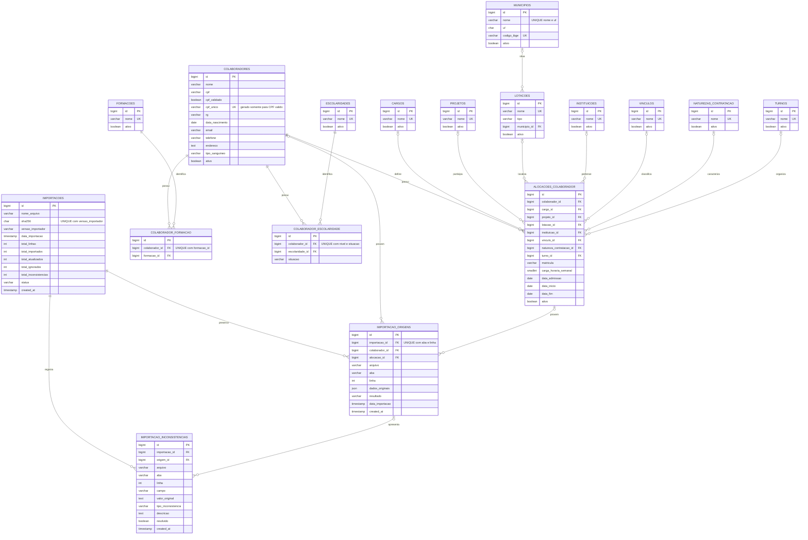

# Diagrama ER — GADSAN

Todas as PKs são IDs internos BIGINT UNSIGNED. Relações sem dados confirmados admitem FK NULL. Exclusões de registros referenciados são restritas. Os campos abaixo destacam chaves e atributos do domínio; tipos, timestamps, índices e restrições completos estão em [schema.sql](../database/schema.sql).

`alocacoes_colaborador` conserva a combinação profissional concreta e permite mais de uma alocação por pessoa. Datas de início/fim não são inferidas da admissão. Os dois relacionamentos educacionais representam nível/situação e formação separadamente. Origem sem colaborador preserva linhas ainda não aptas a formar um cadastro.
